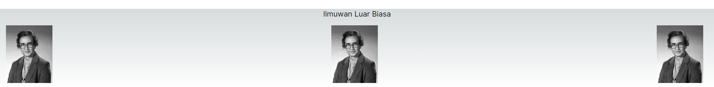

## Laporan Praktikum

|       | Pemrograman Berbasis Framework 2024 |
| ----- | ----------------------------------- |
| NIM   | 2141720222                          |
| Nama  | Diwa Arsyad Atthoriq                |
| Kelas | TI - 3A                             |

### Soal 1

Ubah isi kode Home() sehingga dapat tampil seperti berikut dengan memanfaatkan komponen Profile() yang tadi sudah dibuat dari langkah 1 tersebut!

Capture hasilnya dan buatlah laporan di README.md. Jelaskan apa yang telah Anda pelajari dan bagaimana Anda solve error tersebut?

Jangan lupa push dengan pesan commit: "W03: Jawaban soal 1".

### Jawaban Soal 1

Saya menambahkan domains asal gambar pada next.config.mjs. Serta merubah/mengatur posisi gambar dengan menggunakan css yang di inputkan pada containerImage.
