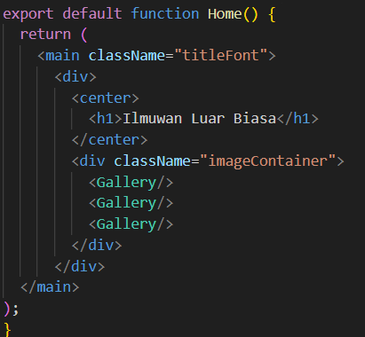

## Laporan Praktikum

|       | Pemrograman Berbasis Framework 2024 |
| ----- | ----------------------------------- |
| NIM   | 2141720222                          |
| Nama  | Diwa Arsyad Atthoriq                |
| Kelas | TI - 3A                             |

### Soal 1

Ubah isi kode Home() sehingga dapat tampil seperti berikut dengan memanfaatkan komponen Profile() yang tadi sudah dibuat dari langkah 1 tersebut!

Capture hasilnya dan buatlah laporan di README.md. Jelaskan apa yang telah Anda pelajari dan bagaimana Anda solve error tersebut?

Jangan lupa push dengan pesan commit: "W03: Jawaban soal 1".

### Jawaban Soal 1

Saya menambahkan domains asal gambar pada next.config.mjs. Serta merubah/mengatur posisi gambar dengan menggunakan css yang di inputkan pada containerImage.

### Soal 2

Capture hasilnya dan buatlah laporan di README.md. Jelaskan apa yang telah Anda pelajari dan bagaimana tampilannya saat ini?

Jangan lupa push dengan pesan commit: "W03: Jawaban soal 2"

### Jawaban Soal 2

Saya dapat memindahkan galeri dari page ke dalam file gallery.tsx dengan memanggil function pada home

### Soal 3

Silakan perbaiki kode JSX berikut ini. Anda boleh menggunakan konverter atau perbaiki secara manual.

Capture hasilnya dan buatlah laporan di README.md. Jelaskan apa yang telah Anda pelajari dan mengapa error itu bisa terjadi?

Jangan lupa push dengan pesan commit: "W03: Jawaban soal 3".

### Jawaban Soal 3

Karena menetapkan kelas pada elemen HTML di react butuh className. Lalu menambahkan tag penutup dan meletakkan lokasi penutup tag dengan benar.

### Soal 4

Kode di atas masih terdapat error, silakan diperbaiki.

Jangan lupa push dengan pesan commit: "W03: Jawaban soal 4".

### Jawaban Soal 3

### Soal 4

Kode di atas masih terdapat error, silakan diperbaiki.

Jangan lupa push dengan pesan commit: "W03: Jawaban soal 4".

### Soal 5

Buka file src/components/todolist.tsx lakukan ekstrak URL gambar ke dalam objek person.

Capture hasilnya dan buatlah laporan di README.md. Apakah ada perbedaan pada tampilan web saat ini?

Jangan lupa push dengan pesan commit: "W03: Jawaban soal 5".

## Soal 6

Perbaiki kode tersebut pada bagian atribut src. Kode lainnya dapat Anda sesuaikan dari jawaban soal sebelumnya. Capture hasilnya dan buatlah laporan di README.md. Jelaskan apa yang telah Anda pelajari dan bagaimana tampilannya saat ini?

Jangan lupa push dengan pesan commit: "W03: Jawaban soal 6".

Catatan:

Untuk memeriksa apakah perbaikan Anda berhasil, coba ubah nilai dari imageSize menjadi 'b'. Gambar harus menyesuaikan ukuran setelah diubah.
